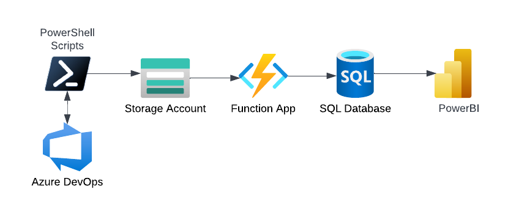

# Azure DevOps Statistics (ADOS)

Data extraction scripts and Power BI reports that generate information about your Azure DevOps organization. Using Azure DevOps CLI and Azure DevOps REST API, PowerShell scripts extract data from Azure DevOps, store this information in an Azure SQL Database that is used by Power BI reports.

## Project Architecture

1. PowerShell Scripts
2. Azure blob storage container
3. Azure function
4. Azure SQL database
5. PowerBI reports



## Azure Blob Storage

Create a storage account in Azure and create a blob container named '**devops-stats**' within that storage account.

## Azure Function

A blob triggered azure function that is invoked when a file is uploaded in the azure storage container.

```c#
        [FunctionName("FileProcessor")]
        public static void Run([BlobTrigger("devops-stats/{name}", Connection = "AzureStorage")]Stream blob, string name, ILogger log)
        {
            log.LogInformation($"Blob trigger function processed blob: {name}, size: {blob.Length} bytes");

            if (!name.EndsWith(".csv"))
            {
                log.LogInformation($"Blob '{name}' doesn't have the .csv extension. Skipping processing.");
                return;
            }

            log.LogInformation($"Blob '{name}' found. Uploading to Azure SQL");

            string azureSQLConnectionString = Environment.GetEnvironmentVariable("AzureSQLConnStr");

            SqlConnection conn = null;
            try
            {
                conn = new SqlConnection(azureSQLConnectionString);
                conn.Execute("EXEC dbo.BulkLoadFromAzure @sourceFileName", new { @sourceFileName = name }, commandTimeout: 180);
                log.LogInformation($"Blob '{name}' uploaded");
            }
            catch (SqlException se)
            {
                log.LogInformation($"Exception Trapped: {se.Message}");
            }
            finally
            {
                conn?.Close();
            }
        }
```

## Azure SQL database

A connection from Azure SQL Server is set up to the external source (here, the storage account).

Azure BULK INSERT is used in a stored procedure to load the CSV file data to azure sql db table. The filename is sent as an input parameter to the stored procedure.

Data is first loaded into a staging table. If data loading is successful, then an entry is made in a header table and then the data from staging is moved to the main table

## Setup

[Setup](docs/setup.md)

## How to use

1. Make sure to set all the [environment variables](docs/setup.md/#environment-variables).
2. Run PowerShell script.

### Example

```powershell
./Collect-Statistics.ps1
```
